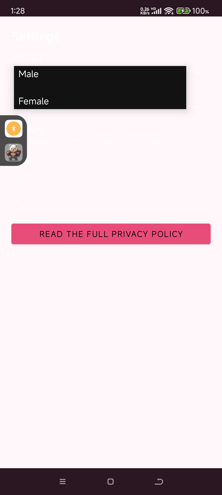
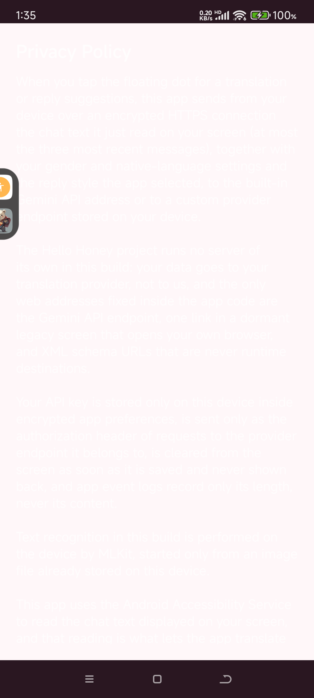

# Hello Honey — Real-Time Cross-Language Chat Assistant for Android

**Tap a floating dot, read a foreign-language chat message, see it translated into your native language, pick a natural reply — you confirm, you send. Hello Honey never sends anything by itself.**

Hello Honey is an Android accessibility-based companion for chat apps like HelloTalk. It reads the chat text currently on your screen (at most the three most recent messages), translates it to your native language, and offers reply suggestions in the same language — you choose and send. It is designed for people chatting across languages who are tired of copying text into a translator and switching apps.

> **Repository status.** This repository is a **portfolio / showcase** for the Hello Honey project: documentation and screenshots of the current build. **No binaries and no source code are published here.** The app ships with an on-device license-key activation scheme (format-validated locally, with a trial counter), and publishing any build would expose that activation logic; the project is currently **paused** (release-frozen). Every capability claim below is what the app actually does on a real device — no store-listing hype, no fabricated screenshots.

## What it does

- **Two-settings setup** — first launch asks only for your **Gender** (male/female, used to match gendered grammar and self-reference in supported languages) and your **Native language** (defaults to **Auto-detect**, reading the device system language, so minority-language users are covered; a dropdown lets you pick Chinese / English / Japanese / Korean / Spanish / French and more).
- **Floating-dot capture** — a persistent overlay dot; tap it and the app reads the chat text on screen via the Android Accessibility Service, then translates it.
- **Translation + reply suggestions** — the message appears at the top translated into your native language, with three reply candidates in the same language (cool / reserved / normal tones), gendered to match your profile.
- **You send** — tapping a suggestion fills your chat input box; sending is always your own finger. The app **never taps buttons in other apps and never sends messages automatically** (enforced and verified in the build).
- **Bring your own key** — translation goes to the built-in Gemini API endpoint or to a custom OpenAI-compatible provider endpoint you configure (provider name, URL, key; one-tap paste). Your key is stored only on this device in encrypted app preferences and is never shown back.
- **On-device text recognition** — MLKit reads text from images already stored on your device; no images are uploaded for recognition.

## Screenshots

| Settings (two-settings setup) | Gender picker | Privacy policy |
|---|---|---|
|  |  |  |

*(Screenshots from the current English build, v1.0.x.)*

## How it works (honest)

When you tap the floating dot for a translation, the app sends — over an encrypted HTTPS connection — the chat text it just read on your screen (at most the three most recent messages), together with your gender and native-language settings and the reply style you selected, to the built-in Gemini API address or to a custom provider endpoint stored on your device.

**The Hello Honey project runs no server of its own in this build:** your data goes to your translation provider, not to us. The only web addresses fixed inside the app code are the Gemini API endpoint, one link in a dormant legacy screen that opens your own browser, and XML schema URLs that are never runtime destinations.

## Privacy

- **No own server** — chat text goes to your translation provider (Gemini or your custom endpoint), never to the publisher.
- **Encrypted key storage** — your API key lives in encrypted app preferences on-device, is sent only as the authorization header of requests to the provider endpoint it belongs to, is cleared from the screen as soon as it is saved and never shown back.
- **Log hygiene** — app event logs record only the *length* of your key, never its content.
- **Accessibility, disclosed** — the app uses the Android Accessibility Service to read chat text on your screen; that reading is what enables translation. It never simulates taps and never sends messages.
- **On-device OCR** — MLKit text recognition runs locally on image files already stored on the device.

## Activation & licensing

Hello Honey uses an on-device license-key activation scheme (a locally format-validated code plus a trial counter) — the same pattern as the publisher's other products. The project is currently **paused / release-frozen**; a commercial release (planned one-time license) is on hold.

## Building / provenance

- Version lineage and release hashes are maintained in the publisher's private release ledger; see [docs/RELEASE-NOTES.md](docs/RELEASE-NOTES.md) for the public summary.
- Current builds: **v1.0.0** (release) and **v1.0.1-demo**. English UI, Android 8.0+ (minSdk 26).

## License

Evaluation license — see [LICENSE](LICENSE). This repository is a showcase: documentation and screenshots may be referenced for portfolio purposes; **commercial redistribution of any artifact is not permitted**.

## Disclaimer

Hello Honey is a translation aid, **not** legal or professional advice, and machine translation can be wrong. It assists you in reading and replying across languages; always review a translation before sending anything important. The app never sends automatically — but the choice to send remains yours.